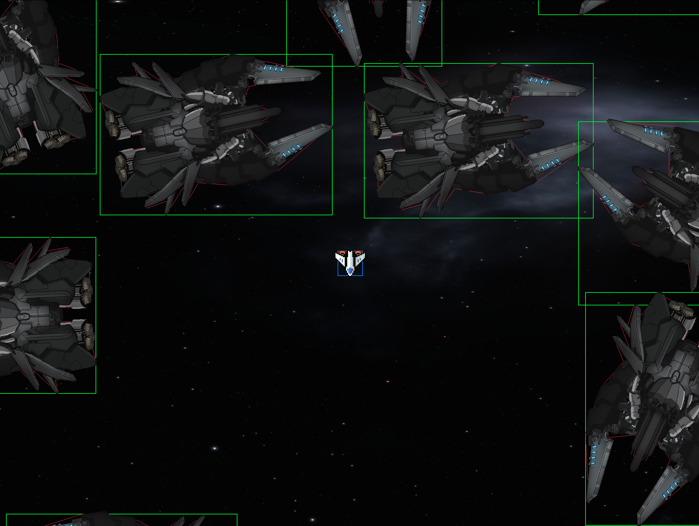

# Aspace

Aspace is a simple 2D top-down ship demo built with [Raylib](https://raylib.com/) and C++.

## Introducing Collision System



Right now the game features a Separating Axis Theorem (SAT) based collision detection system that provides:

- 70% - 80% Accurate convex polygon collision detection
- AABB checks if AABB passes then only SAT is computed
- Minimum translation vectors for collision resolution
- Support for rotating hitboxes
- High performance through spatial partitioning
- Each entity can have its own collision shape defined as a convex polygon, allowing for precise interactions between game objects.
- For now the collision vertices are hardcoded to their respective ship class.


## Features

- Pixel‑art ship with modular sprite‑parts (thrusters, weapons, …)
- Player‑controller wrapper that can swap to bigger ships later
- Camera that follows any `CameraTarget` entity
- Component‑based world grid for lightweight collision / culling
- Pure CMake build – no Makefile hacks – ships with raylib sources
- **NEW** SAT-based collision detection system for accurate hitboxes

---

## Prerequisites

|               | Windows                         | Linux / macOS                    |
|---------------|---------------------------------|----------------------------------|
| **Compiler**  | MinGW‑w64 10+ | This project currently downloads pre-built Raylib binaries for **Windows** (MinGW). If you want to build on other platforms, you may need to supply different Raylib binaries or build Raylib from source yourself and use the respective Operating system specific compiler. |
| **CMake**     | [CMake](https://cmake.org/download/) ≥ 3.10...3.90                          | 3.10+  |
| **Ninja**     | *(optional)* `choco install ninja` or `scoop install ninja`  | `sudo apt install ninja-build` or `brew install ninja` |

> **No global raylib install is required** – the build pulls the exact tag we need. (Which is 250 MB)

---

## Getting the code

```bash
git clone --recursive https://github.com/zenzxnse/Aspace.git
cd space‑something
```

*Using `--recursive` is only needed if you keep raylib as a git‑submodule.
With FetchContent (default), a plain `git clone` is enough.*

---

## Building

### Quick Build (Debug and Release)

```bash
# Run the build script - builds both Debug and Release versions
./build.bat
```

### Build (Debug)

```bash
cmake -G Ninja -B build -DCMAKE_BUILD_TYPE=Debug
cmake --build build
```

# Or Hit F5 (Make sure you have CMake Tools installed as well as g++)
# For MacOs or Linux you may want to use the terminal instead of Visual Studio since the compiler path is hardcoded into tasks for windows.

### Build (Release)

```bash
cmake -G Ninja -B build -DCMAKE_BUILD_TYPE=Release
cmake --build build
```

### Run

```bash
./build/bin/Aspace
```

## Project Layout

```
├── CMakeLists.txt      # Build configuration (FetchContent for Raylib)
├── include/            # Public headers (Entity, World, Animator, etc.)
├── src/                # Game source files (main.cpp, BasicShip)
├── rsc/                # Resources (textures, spritesheets)
└── build/              # Out‑of‑source build directory
```

## License

Aspace is released under the MIT License. See [LICENSE](LICENSE) for details.

## Author

**Zenzxnse**